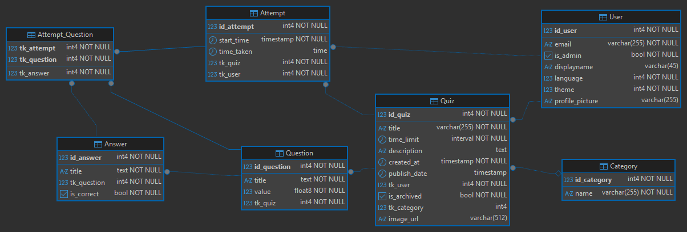
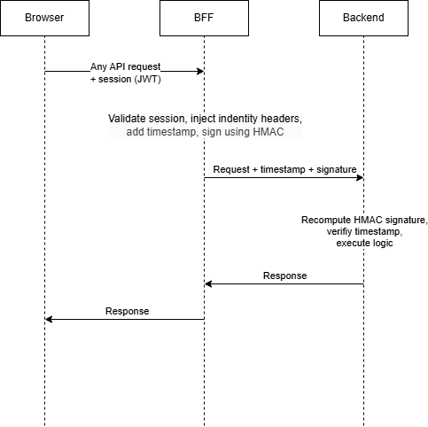
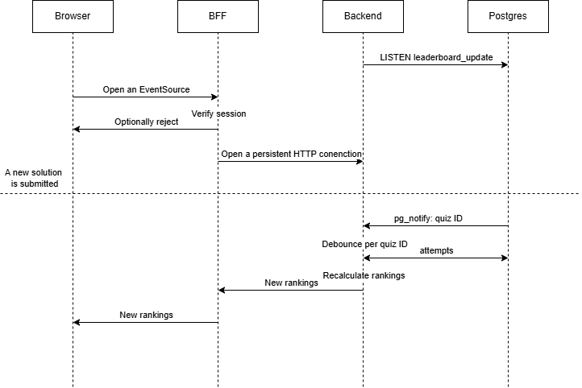
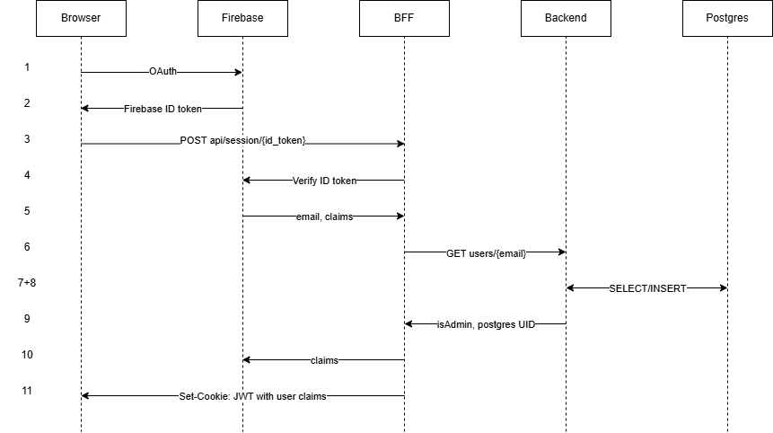

# Quizio — Architecture

This document describes the software architecture of the **Quizio** platform.

---

## Table of Contents

- [1. System Overview](#1-system-overview)
- [2. Component Design](#2-component-design)
  - [2.1 Next.js Frontend & BFF](#21-nextjs-frontend--bff)
  - [2.2 Go Backend](#22-go-backend)
  - [2.3 PostgreSQL Database](#23-postgresql-database)
- [3. Core Workflows](#3-core-workflows)
  - [3.1 Quiz Attempt Lifecycle](#31-quiz-attempt-lifecycle)
  - [3.2 Real-Time Leaderboard](#32-real-time-leaderboard)
  - [3.3 Authentication & Session Flow](#33-authentication--session-flow)
- [4. Security](#4-security)

---

## 1. System Overview

Quizio uses a **BFF (Backend-For-Frontend)** architecture. The Next.js process serves as the sole entry point for browser traffic, handling session management, RBAC enforcement, and request signing before forwarding to the Go API. The Go server is a stateless REST API. PostgreSQL is the Single Source of Truth for all mutable state, including quiz timers.

```
Browser
  │
  ▼
Next.js BFF  ──────────────────────────────►  Firebase Auth
  │  (session validation, RBAC, HMAC signing)
  │
  ▼
Go REST API  (stateless, HMAC-verified)
  │
  ▼
PostgreSQL  (all persistent state + pg_notify triggers)
  │
  └──► LeaderboardHub ──► SSE ──► Next.js SSE Proxy ──► Browser
```

### Component Summary

| Component | Layer | Responsibility |
|---|---|---|
| Browser Client | Frontend | Renders UI; sends requests and subscribes to SSE leaderboard stream |
| Firebase Session Validator | BFF | Exchanges Firebase ID tokens for HTTP-only session cookies |
| Route Guard / RBAC Enforcer | BFF | Blocks admin-only routes for non-admin users before forwarding |
| HMAC Request Signer | BFF | Signs all outgoing requests with HMAC-SHA256 and injects identity headers |
| SSE Leaderboard Proxy | BFF | Forwards and pipes the leaderboard SSE stream to the browser |
| Integrity Middleware | Go | Verifies HMAC signature and timestamp on every incoming request |
| Auth Middleware | Go | Extracts `X-User-*` identity headers into the request context |
| Chi HTTP Router | Go | Routes requests to the appropriate handler |
| Leaderboard Hub | Go | Listens on `pg_notify`, debounces events, recalculates rankings, broadcasts SSE |
| PostgreSQL Database | Data | Stores all state; fires `AFTER INSERT OR UPDATE` triggers on the Attempt table |
| Firebase Auth | External | Handles user registration and authentication |
| Gemini API | External | Generates quiz questions and answers |
| Supabase storage | External | Stores images |

---

## 2. Component Design

### 2.1 Next.js Frontend & BFF

The Next.js process serves the react frontend and acts as a BFF (handles auth, proxies requests and exposes additional routes).

**Session management (`POST /api/session`)**

The client authenticates via the Firebase Client SDK and receives a short-lived ID token. This token is sent to the BFF, which verifies it using the Firebase Admin SDK. On success, the BFF sets an HTTP-only session cookie that contains user claims (such as isAdmin and postgresId). Subsequent requests carry this cookie; the BFF validates it on every relevant request.

**User registration sync**

On first login, the BFF calls the Go backend to check whether the user exists in PostgreSQL. If not, it creates the record and updates the Firebase custom claims with `postgresId` and `isAdmin`.

**BFF Proxy (`/api/proxy/[...path]`)**

Most browser API calls are routed through this proxy, which applies the following in order:

1. Validates the session cookie — unauthenticated requests are rejected immediately
2. Enforces RBAC via route regex matching — non-admin users receive `403 Forbidden` for admin-only routes
3. Injects identity headers: `X-User-Id`, `X-User-Email`, `X-User-IsAdmin` and a timestamp header `X-Timestamp`
4. Signs the request with HMAC-SHA256 and forwards it to the Go backend

**SSE proxy (`/api/sse`)**

Establishes a long-lived connection to the Go backend and pipes the SSE leaderboard stream back to the browser.

**Other custom routes**

The Next.js process aditionally exposes routes for image uplaods via supabase and ai quiz generation.

---

### 2.2 Go Backend

The Go server is a stateless HTTP server. No session or attempt state is held in memory between requests — all state lives in PostgreSQL.

**Middleware chain** (applied to every request in order):

1. **Integrity Middleware** — decodes the request timestamp, recomputes the HMAC-SHA256 signature using the shared `HMAC_SECRET`, and rejects the request if the signature does not match or if the timestamp is more than 10 seconds stale
2. **Auth Middleware** — extracts `X-User-Id`, `X-User-Email`, and `X-User-IsAdmin` from the headers injected by the BFF and loads them into the request context

**Routes and OpenAPI**

All routes and dtos are well documented and available via swagger on [http://localhost:8080/swagger/index.html](http://localhost:8080/swagger/index.html).

**Leaderboard Hub**

A persistent goroutine that listens on the PostgreSQL `leaderboard_update` channel via `pq.Listener`. On receiving a `pg_notify` event, it debounces per `quiz_id`, queries finished attempts, calculates rankings, and broadcasts the result over Go channels to all active SSE subscriber goroutines.

---


### 2.3 PostgreSQL Database

PostgreSQL is the single source of truth for all mutable state.
If you want to view the whole up-to-date schema take a look at [schema.sql](schema.sql).

**Schema**



**Event notifications**

An `AFTER INSERT OR UPDATE` trigger on the `Attempt` table fires `pg_notify('leaderboard_update', quiz_id::text)` whenever an attempt's `time_taken` is committed, initiating the real-time leaderboard update pipeline.

**Database access**

All queries are generated by `sqlc` from SQL definitions at build time, producing type-safe Go functions that use parameterised prepared statements.

---

## 3. Core Workflows

### 3.1 Request flow



---

### 3.2 Real-Time Leaderboard



---

### 3.3 Authentication & Session Flow



The Go backend never receives a Firebase token. It operates solely on the `X-User-*` headers injected by the BFF.

---

## 4. Security

| Control | Description |
|---|---|
| **Network isolation** | The Go API port must not be publicly exposed. All browser traffic flows through the Next.js BFF. |
| **HMAC-SHA256 signing** | Every BFF-to-backend request is signed with a shared `HMAC_SECRET` and a millisecond-precision timestamp. Requests with a timestamp skew greater than 10 seconds are rejected to prevent replay attacks. |
| **RBAC** | Admin-only routes are enforced at the BFF before the request reaches the Go backend. Unauthorised requests receive `403 Forbidden` and are never forwarded. |
| **Identity header trust** | The Go backend trusts `X-User-*` headers only because HMAC signing guarantees they originate from the BFF. Direct calls to the Go API without a valid signature are rejected. |
| **SQL injection prevention** | All queries are generated by `sqlc` at build time as parameterised prepared statements. No user input is interpolated into SQL strings. |
| **Session cookies** | HTTP-only; not accessible to JavaScript. Firebase tokens are never forwarded beyond the BFF. |
| **Timer integrity** | Timer state lives in PostgreSQL. Client-side manipulation, browser closure, or forged requests after expiry cannot extend an attempt window. |