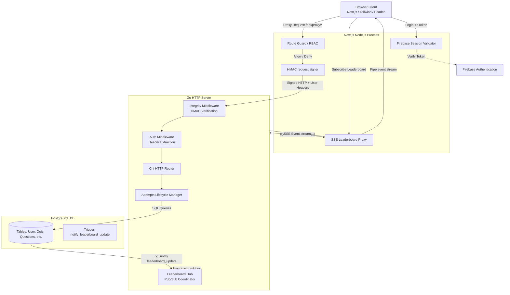

# Quizio — Software Architecture Document (SAD)

This document provides a detailed overview of the software architecture of the **Quizio** platform.

---

## 1. System Overview

Quizio is built using a **BFF (Backend-For-Frontend)** architecture pattern. This design decouples client-side user sessions and authorization from the main Go application server. The Go server acts as a stateless REST API, relying completely on a PostgreSQL database as the Single Source of Truth (SOT) for both quiz settings and live attempt timers.



---

## 2. Component Design & Responsibilities

### 2.1 Next.js Frontend & BFF Proxy
The Next.js framework fulfills two roles: serving the static/interactive client components and hosting server-side routes (BFF).

*   **Firebase Authentication**: The client SDK authenticates credentials. The ID token is exchanged via `POST /api/session` for a session cookie managed by the BFF (`SESSION_COOKIE_NAME = "session"`).
*   **User Registration Sync**: When a session cookie is created, the BFF calls the Go backend to check if the user is in PostgreSQL. If missing, it creates the database record and updates the Firebase custom claims with the `postgresId` and `isAdmin` flags.
*   **BFF Proxy Routing (`next/src/app/api/proxy/[...path]`)**:
    *   Intercepts client API requests under `/api/proxy/...`.
    *   Checks if the user has a valid session cookie.
    *   **RBAC (Role-Based Access Control)**: Restricts admin actions (e.g. creating/modifying quizzes/questions) using route regex matching. Non-admins receive `403 Forbidden` immediately.
    *   **Identity Injection**: Injects identity headers into the proxy request: `X-User-Id`, `X-User-Email`, `X-User-IsAdmin`.
*   **Request Integrity & HMAC Signing**: Before forwarding requests, the BFF signs the headers, body, and timestamp using `HMAC-SHA256` with a shared secret (`HMAC_SECRET`). This prevents direct manipulation of identity headers or backend bypass.
*   **SSE Streaming Proxy**: A custom route handles real-time leaderboards by forwarding the SSE connection to the backend and piping the stream back to the browser.

### 2.2 Go Backend
The Go application is a stateless REST API designed to run concurrently.

*   **Integrity Middleware**: Decodes the request timestamp and signature. It verifies the signature against the shared secret and checks for timestamp skew (max 10s skew allowed) to prevent replay attacks.
*   **Auth Middleware**: Extract `X-User-...` headers injected by the trusted BFF and loads user identity claims into the request Context.
*   **Attempts Manager**: Manages attempt sessions. The backend calculates whether an attempt is still within the quiz time limits. It allows incremental answers during an active session and computes scores upon completion.
*   **Leaderboard Hub**: A Go Pub/Sub coordinator listening for PostgreSQL database events. It handles real-time calculations and streams leaderboard updates using Server-Sent Events (SSE).

### 2.3 PostgreSQL Database
All persistent state resides in PostgreSQL. 

*   **Database Access**: Handled via Go code generated by `sqlc` from strict schema structures and SQL queries, ensuring zero runtime SQL reflection overhead.
*   **DB Event Notifications**: An `AFTER INSERT OR UPDATE` trigger on the `Attempt` table fires `pg_notify` notifications over the `leaderboard_update` channel containing the affected `quiz_id` when attempts are finished.

---

## 3. Core Architectural Workflows

### 3.1 Quiz Attempt Lifecycle
Rather than holding active attempt states in memory, the system uses the database as SOT.

1.  **Initialization**: User starts a quiz $\rightarrow$ client invokes `POST /attempts` $\rightarrow$ Go backend creates an entry in `Attempt` containing `start_time` and returning `id_Attempt`.
2.  **Incremental Answer Saving**: As the user answers questions, the client calls `PATCH /attempts` containing the changes. The backend inserts or updates `Attempt_Question` rows. If the attempt has expired, the update is blocked, and the attempt is automatically marked as finished.
3.  **Finalization**: User clicks submit or time runs out $\rightarrow$ client triggers `POST /attempts/finish` $\rightarrow$ backend calculates the elapsed duration, sets `time_taken`, and marks it completed. If the client closes their tab, the database evaluates the attempt as inactive if `NOW() >= start_time + time_limit`.

### 3.2 Real-time Leaderboard Calculations
The system updates leaderboard charts dynamically without client polling.

```
┌───────────┐         ┌───────────┐          ┌──────────┐          ┌────────────────┐          ┌───────────┐
│  Browser  │         │ Next BFF  │          │ Go App   │          │  PostgreSQL    │          │  DB Hub   │
└─────┬─────┘         └─────┬─────┘          └────┬─────┘          └───────┬────────┘          └─────┬─────┘
      │                     │                     │                        │                     │
      │── Finish Attempt ──>│                     │                        │                     │
      │                     │── Finish Attempt ──>│                        │                     │
      │                     │   (Signed HMAC)     │── Commit time_taken ──>│                     │
      │                     │                     │                        │── Trigger notify ──>│
      │                     │                     │                        │   (pg_notify)       │── Update ─┐
      │                     │                     │                        │                     │           │ (Debounce)
      │                     │                     │                        │                     │<──────────┘
      │                     │                     │<── Calculate rankings ───────────────────────│
      │                     │                     │── Broadcast entries ──>│                     │
      │                     │<── Stream JSON ──────────────────────────────│                     │
      │<── Pipe SSE event ────────────────────────│                        │                     │
```

1.  **Trigger**: On commit of an attempt's `time_taken` field, the database trigger notifies the Go listener via `pg_notify`.
2.  **Debounce**: The `LeaderboardHub` catches the event and debounces updates by `100ms` per `quiz_id` to handle concurrent finishes gracefully.
3.  **Calculation**: The hub queries the database for all finished attempts for the quiz, evaluates correct answers, and sorts the entries.
4.  **Tie-Breaker Logic**: Players are ranked in descending order by **Achieved Points**. If points are tied, they are ranked in ascending order by **Time Taken** (faster completion wins).
5.  **Broadcast**: The updated rankings are broadcast over Go channels to all active SSE subscribers.

---

## 4. Security Architecture

*   **BFF Barrier**: No Firebase credentials or third-party validation tokens are shared with the Go backend. Go trusts only the Next.js BFF proxy.
*   **HMAC Signature**: Ensures that the Go backend cannot be queried directly from the internet. Requests missing the correct signature or containing stale timestamps are dropped at the door.
*   **SQL Injection Prevention**: All queries are compiled and parameterized using `sqlc`, leaving zero surface area for string-concatenated SQL injection attacks.
